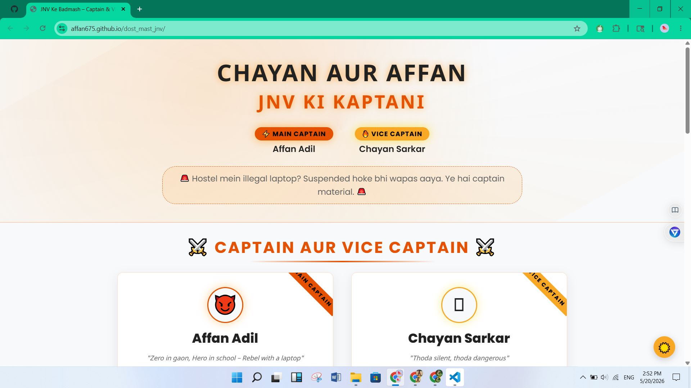
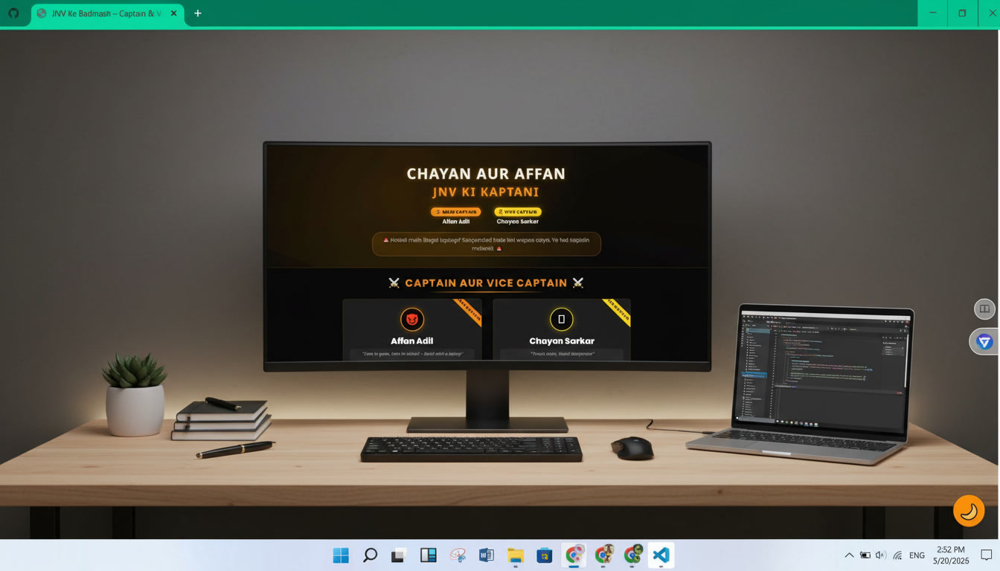
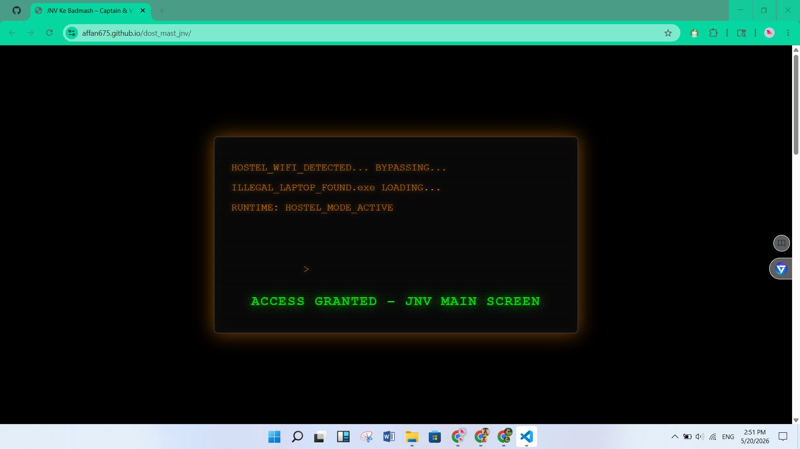
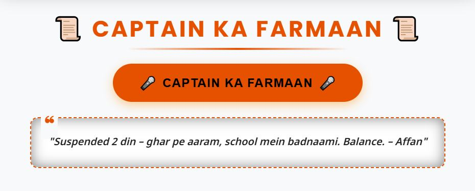
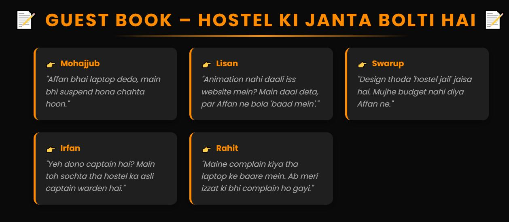

<!-- CENTERED HEADER -->
<div align="center">
  <h1>⚡ JNV Ke Badmash – Captain & Vice</h1>
  <p><em>“Zero in gaon, Hero in school – Rebel with a laptop”</em></p>
</div>

<!-- BADGES -->
<div align="center">


</div>

---

## 📖 Table of Contents
- [🚀 Overview](#-overview)
- [✨ Features](#-features)
- [📸 Screenshots](#-screenshots)
- [🛠️ Tech Stack](#%EF%B8%8F-tech-stack)
- [📂 Folder Structure](#-folder-structure)
- [⚙️ Installation & Setup](#%EF%B8%8F-installation--setup)
- [🕹️ Usage](#%EF%B8%8F-usage)
- [🌐 Live Demo](#-live-demo)
- [🤝 Contributing](#-contributing)
- [🔮 Future Improvements](#-future-improvements)
- [📄 License](#-license)
- [👤 Author](#-author)

</div>

---

## 🚀 Overview

A **mobile-first, fully responsive** one‑page website built for the legendary hostel duo – **Affan Adil (Captain)** and **Chayan Sarkar (Vice Captain)**. Packed with interactive rivalry sliders, random quote generators, a fake guest book, and a hacker‑style boot preloader. All text is in **Hinglish** with Hindi/Bengali support. No backend – pure frontend fun.
Experience the nostalgic chaos of hostel life, JNV style!

---

## ✨ Features

- 🎨 **Dark/Light Theme** – Toggle with a floating button, preference saved in localStorage for a personalized browsing experience.
- 💻 **Illegal Laptop Boot Preloader** – A captivating terminal simulation of Affan’s infamous suspension story, setting the mood right from the start.
- 🃏 **Profile Cards** – Side‑by‑side captain & vice cards, revealing their unique personalities, inside jokes, and defining traits.
- ⚔️ **Rivalry Meter** – An interactive slider that dynamically updates the “dangerous” level between the two, complete with live, witty messages.
- 📜 **Random Quote Generator** – Click the “Captain ka farmaan” button to unveil a collection of hilarious and insightful Hinglish dialogues from the legends themselves.
- 📝 **Guest Book** – A collection of fake, yet authentic-sounding, comments from their hostel friends (Mohajjub, Rahit, Lisan…), adding to the immersive experience.
- 📱 **Fully Responsive** – Designed with a mobile-first approach, ensuring seamless grid layouts and optimal viewing across all devices, from smartphones to desktops.
- 🌐 **Google Fonts** – Utilizes a carefully selected combination of Poppins, Noto Sans Devanagari, and Noto Sans Bengali for aesthetic and linguistic support.
- ⚡ **Touch‑optimised** – Engineered for smooth interactions with 44px minimum touch targets, providing an excellent user experience on touch-enabled devices.

---

## 📸 Screenshots

| Light Mode | Dark Mode |
|:---:|:---:|
|  |  |
| *Clean light theme with orange accents* | *Edgy dark mode – hostel rebel vibes* |

| Boot Preloader | Rivalry Meter |
|:---:|:---:|
|  | ![Rivalry Slider](assets/screenshots/rival.JPG |
| *“HOSTEL_WIFI_DETECTED… ACCESS GRANTED”* | *Slide to decide who’s more dangerous* |

| Quote Generator | Guest Book |
|:---:|:---:|
|  |  |
| *Random Hinglish quotes from the legends* | *Fake comments from the hostel gang* |

> *Note:* Replace the screenshot paths with actual screenshots from `assets/screenshots/`.
> **Important Note:** Please replace the placeholder screenshot paths with actual images from the `assets/screenshots/` directory to fully showcase the project!
---

## 🛠️ Tech Stack

| Technology | Usage |
|------------|-------|
| **HTML5** | Semantic structure, content sections |
| **HTML5** | Semantic structure, content sections, accessibility. |
| **CSS3** | Custom properties, Flexbox, Grid for responsive layouts, animations, and theme management. |
| **Vanilla JavaScript** | Interactive elements like slider logic, quote generation, theme toggle, and preloader functionality. |
| **Google Fonts** | Custom typography for English, Hindi, and Bengali text. |
| **Shields.io** | Dynamic badges for README status and information. |
| **LocalStorage** | Client-side persistence for user's theme preference. |

---

## 📂 Folder Structure
```
project/
├── index.html
├── css/
│   ├── style.css
│   ├── responsive.css
│   ├── theme_toggle.css
│   └── preloader.css
├── js/
│   ├── script.js
│   ├── theme_toggle.js
│   └── preloader.js
└── assets/
    └── screenshots/
        ├── home_page.jpg
        ├── dark-theme.jpg
        ├── loader.jpg
        ├── rivalry-slider.png
        ├── quote-generator.png
        └── guest-book.png
```

---

## ⚙️ Installation & Setup

1.  **Clone the repository:**
   ```bash
   git clone https://github.com/affan675/dost-mast-jnv.git
   cd jnv-ke-badmash
   ```
2.  **Open `index.html`:**
    Simply open the `index.html` file directly in your web browser. No local server is required as this is a pure frontend project.

    *(Alternatively, for development, use a tool like Live Server in VS Code for hot reloading and easier debugging.)*

Enjoy the hostel rebel experience.

🕹️ Usage
1.  **Boot Animation:** Open the site and witness the captivating illegal laptop boot animation.
2.  **Theme Toggle:** Switch between light and dark themes using the floating button located at the bottom‑right of the screen. Your preference will be saved.
3.  **Rivalry Meter:** Interact with the slider to dynamically adjust and see who's considered "more illegal" between the Captain and Vice Captain.
4.  **Captain's Command:** Click the “Captain ka farmaan” button to generate a random, witty quote.
5.  **Guest Book:** Scroll down to read the amusing fake comments from the hostel gang.

All interactions are instant and the site works seamlessly offline.

🌐 Live Demo
🚧 Coming soon – Now is deployed on GitHub Pages.
(Link placeholder: https://affan675.github.io/dost_mast_jnv)

🤝 Contributing
Pull requests are warmly welcome! If you have major changes or new features in mind, please open an issue first to discuss your ideas.

**Important:** When contributing, please strive to keep the unique "Hinglish" vibe intact – the text is a cultural goldmine! 😉

🔮 Future Improvements
-   Add sound effects (e.g., boot beep, quote delivery chime) for an even more immersive experience.
-   Implement an Easter egg: a hidden “Rahit’s Revenge” mini‑game.
-   Convert the project to a Progressive Web App (PWA) for offline mobile installation and enhanced performance.
-   Integrate a real backend (e.g., Firebase) to enable actual guestbook submissions.
-   Add animated confetti or celebratory effects when the rivalry slider hits 100%.

📄 License
This project is licensed under the MIT License. See the `LICENSE` file in the repository for full details.

👤 Author
Affan Adil
Hostel legends, suspension survivors, captain material.
“Rahit ka revenge abhi bhi pending hai.”

<div align="center"> <sub>Built with ❤️ in 2 periods. Suspension included.</sub> </div> ```